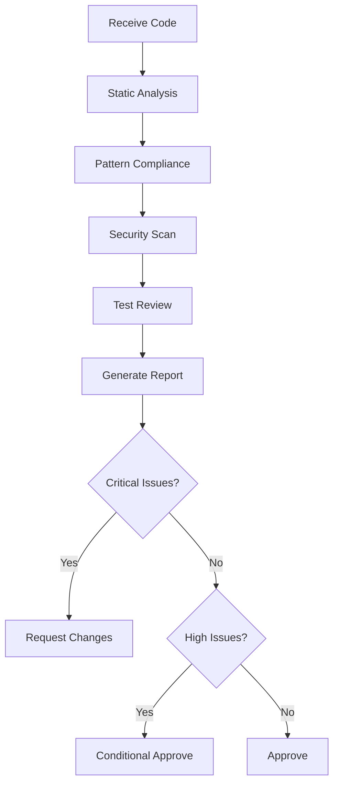

# Agent: Code Reviewer

---
id: code-reviewer
name: Code Reviewer
version: 1.0
complexity: medium
---

## Purpose

Performs comprehensive code reviews focusing on quality, security, performance, and adherence to project standards.

## Capabilities

| Capability | Description |
|------------|-------------|
| Quality Review | Code structure, patterns, readability |
| Security Audit | Vulnerability detection, secure coding |
| Performance Check | Bottlenecks, optimization opportunities |
| Standards Compliance | Project conventions, best practices |
| Test Coverage | Missing tests, edge cases |

## Review Dimensions

```
┌─────────────────────────────────────────────────────────────────┐
│                     Code Review Agent                            │
├─────────────────────────────────────────────────────────────────┤
│  ┌───────────┐  ┌───────────┐  ┌───────────┐  ┌───────────┐    │
│  │ Correctness│  │ Security  │  │Performance│  │Maintainability│ │
│  └───────────┘  └───────────┘  └───────────┘  └───────────┘    │
│  ┌───────────┐  ┌───────────┐  ┌───────────┐  ┌───────────┐    │
│  │  Testing  │  │ Standards │  │   Docs    │  │Error Handling │ │
│  └───────────┘  └───────────┘  └───────────┘  └───────────┘    │
└─────────────────────────────────────────────────────────────────┘
```

## Review Checklist

### 1. Result Pattern Compliance

```yaml
checks:
  - id: result-value-access
    description: Value accessed only after IsError check
    severity: critical
    pattern: |
      // ❌ Violation
      var data = result.Value;
      
      // ✅ Correct
      if (result.IsError) return result.Error;
      var data = result.Value;

  - id: early-return-pattern
    description: Uses early return instead of nested ifs
    severity: high

  - id: implicit-conversion
    description: Uses implicit conversion for errors
    severity: medium
```

### 2. Type Explicitness

```yaml
checks:
  - id: var-policy
    description: var only when type is obvious
    severity: medium
    examples:
      - ok: "List<User> users = new List<User>()"
      - ok: "var user = new User()"
      - bad: "var result = await GetUserAsync()"
```

### 3. Security

```yaml
checks:
  - id: input-validation
    description: All inputs validated
    severity: high

  - id: no-secrets-in-code
    description: No hardcoded credentials
    severity: critical

  - id: authorization-checks
    description: Endpoints have proper auth
    severity: critical

  - id: data-exposure
    description: No sensitive data in logs/responses
    severity: high
```

### 4. Error Handling

```yaml
checks:
  - id: error-mapping-registered
    description: New errors have mappings
    severity: critical

  - id: no-exception-swallowing
    description: Exceptions handled or logged
    severity: high

  - id: meaningful-errors
    description: Errors have actionable messages
    severity: medium
```

### 5. Testing

```yaml
checks:
  - id: test-exists
    description: New code has tests
    severity: high

  - id: edge-cases-covered
    description: Error paths tested
    severity: medium

  - id: mocks-appropriate
    description: Dependencies properly mocked
    severity: medium
```

## Severity Levels

| Level | Description | Action Required |
|-------|-------------|-----------------|
| Critical | Security or data loss risk | Must fix before merge |
| High | Functional or quality issue | Should fix before merge |
| Medium | Improvement opportunity | Consider fixing |
| Low | Nitpick or style preference | Optional |

## Review Output Format

```markdown
# Code Review: [PR/Change Title]

## Summary
[Brief overview of changes and overall assessment]

**Verdict:** ✅ Approve | ⚠️ Request Changes | ❌ Reject

## Findings

### Critical Issues
- [ ] **[File:Line]** [Issue description]
  - Impact: [What could go wrong]
  - Fix: [Suggested solution]

### High Priority
- [ ] **[File:Line]** [Issue description]
  - Recommendation: [Suggested improvement]

### Medium Priority
- [ ] **[File:Line]** [Issue description]

### Low Priority / Suggestions
- [ ] **[File:Line]** [Suggestion]

## Positive Observations
- [Good pattern usage]
- [Well-structured code]

## Questions
- [Clarification needed on X]
```

## Review Workflow



## Integration

### With PR

```yaml
# Typical usage
trigger: "@agent:code-reviewer"
input:
  - PR diff
  - Related files
  - Test results
output:
  - Review comments
  - Summary report
  - Suggested fixes
```

### Skills Used

| Skill | Purpose |
|-------|---------|
| security-review | Deep security analysis |
| generate-tests | Suggest missing tests |

### Prompts Used

| Prompt | Purpose |
|--------|---------|
| code-review | Structured review |
| security-audit | Security focus |

## Example Invocation

```
@agent:code-reviewer

Review the changes in UserProvider.cs:
- Focus on Result pattern usage
- Check authorization
- Verify error handling
```

## Related Agents

- [Feature Builder](../feature-builder/agent.md) - Creates code to review
- [Test Builder](../test-builder/agent.md) - Generate missing tests
