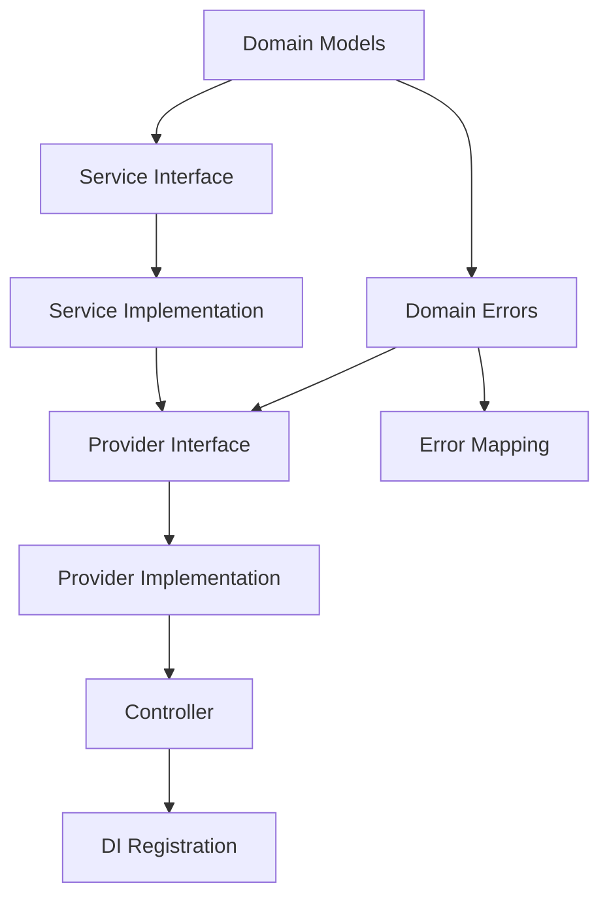

# Feature Builder Workflow

## Workflow Definition

```yaml
name: feature-builder-workflow
version: "1.0"
trigger: "@agent:feature-builder"
```

## State Machine

```
┌──────────┐    ┌──────────┐    ┌──────────┐    ┌──────────┐    ┌──────────┐
│  START   │ → │ ANALYZE  │ → │   PLAN   │ → │  CREATE  │ → │   TEST   │
└──────────┘    └──────────┘    └──────────┘    └──────────┘    └──────────┘
                     │                               │                │
                     ↓                               ↓                ↓
                ┌──────────┐                   ┌──────────┐    ┌──────────┐
                │  ABORT   │                   │ ROLLBACK │    │ VALIDATE │
                └──────────┘                   └──────────┘    └──────────┘
                                                                     │
                                                                     ↓
                                                              ┌──────────┐
                                                              │ COMPLETE │
                                                              └──────────┘
```

## Step 1: ANALYZE

### Objective
Understand the feature requirements and existing codebase context.

### Actions

```yaml
actions:
  - id: parse_requirements
    description: Extract structured requirements from user input
    output:
      feature_name: string
      endpoints: Endpoint[]
      integrations: Integration[]
      business_rules: string[]

  - id: scan_existing_code
    description: Find related existing implementations
    tools:
      - semantic_search
      - grep_search
    output:
      related_providers: string[]
      related_services: string[]
      existing_patterns: string[]

  - id: identify_dependencies
    description: Determine external dependencies needed
    output:
      new_packages: string[]
      new_services: string[]
      config_changes: string[]
```

### Transition Rules

| Condition | Next State |
|-----------|------------|
| Requirements unclear | ABORT (request clarification) |
| Dependencies unavailable | ABORT (list missing deps) |
| Analysis complete | PLAN |

---

## Step 2: PLAN

### Objective
Design the feature architecture and create implementation plan.

### Actions

```yaml
actions:
  - id: design_components
    description: Define components and their relationships
    output:
      components:
        - name: string
          type: model|provider|service|controller
          dependencies: string[]

  - id: create_task_list
    description: Break down into atomic tasks
    output:
      tasks:
        - id: string
          description: string
          skill: string
          order: number
          depends_on: string[]

  - id: estimate_complexity
    description: Assess implementation complexity
    output:
      total_files: number
      estimated_time: string
      risk_level: low|medium|high
```

### Task Template

```yaml
# Example task list structure
tasks:
  - id: create-models
    description: Create domain models and DTOs
    skill: null  # Manual implementation
    order: 1
    depends_on: []

  - id: create-errors
    description: Define domain-specific errors
    skill: add-error-mapping
    order: 2
    depends_on: [create-models]

  - id: create-service
    description: Implement external service integration
    skill: add-http-client
    order: 3
    depends_on: [create-models]
    condition: has_external_integration

  - id: create-provider
    description: Implement business logic provider
    skill: create-provider
    order: 4
    depends_on: [create-models, create-service?]

  - id: create-controller
    description: Implement API controller
    skill: create-endpoint
    order: 5
    depends_on: [create-provider]

  - id: register-errors
    description: Add error mappings
    skill: add-error-mapping
    order: 6
    depends_on: [create-errors]

  - id: generate-tests
    description: Create unit and integration tests
    skill: generate-tests
    order: 7
    depends_on: [create-provider, create-service?, create-controller]
```

### Transition Rules

| Condition | Next State |
|-----------|------------|
| Plan too complex | ABORT (suggest decomposition) |
| User rejects plan | ABORT |
| Plan approved | CREATE |

---

## Step 3: CREATE

### Objective
Implement all planned components following project patterns.

### Execution Order



### Actions

```yaml
actions:
  - id: create_domain_models
    skill: null
    template: |
      // Domain/{Feature}Models.cs
      namespace {YourProject}.Domain;
      
      public record {Feature}Request(...);
      public record {Feature}Response(...);

  - id: create_service
    skill: add-http-client
    condition: has_external_integration
    inputs:
      service_name: from plan
      base_url: from config
      operations: from requirements

  - id: create_provider
    skill: create-provider
    inputs:
      provider_name: "{Feature}Provider"
      operations: from plan
      dependencies: from plan

  - id: create_controller
    skill: create-endpoint
    inputs:
      controller_name: "{Feature}Controller"
      api_version: from requirements
      endpoints: from requirements

  - id: configure_error_mapping
    skill: add-error-mapping
    inputs:
      error_types: from create_domain_models
```

### Checkpoint Validation

After each file creation:
```yaml
validation:
  - check: compilation
    action: get_errors
    on_fail: rollback_file

  - check: pattern_compliance
    rules:
      - result_pattern_used
      - no_var_unless_obvious
      - dependency_handler_added
    on_fail: fix_or_rollback
```

### Transition Rules

| Condition | Next State |
|-----------|------------|
| Any file creation fails | ROLLBACK |
| Compilation errors | ROLLBACK |
| All files created | TEST |

---

## Step 4: TEST

### Objective
Generate comprehensive tests for all created components.

### Actions

```yaml
actions:
  - id: generate_provider_tests
    skill: generate-tests
    inputs:
      target: provider
      coverage_target: 90%
      scenarios:
        - success_path
        - error_paths
        - edge_cases

  - id: generate_service_tests
    skill: generate-tests
    condition: has_external_integration
    inputs:
      target: service
      mock_http: true
      scenarios:
        - successful_response
        - error_response
        - timeout
        - retry

  - id: generate_controller_tests
    skill: generate-tests
    inputs:
      target: controller
      test_type: integration
      scenarios:
        - valid_request
        - invalid_request
        - not_found
        - unauthorized
```

### Transition Rules

| Condition | Next State |
|-----------|------------|
| Test generation fails | ROLLBACK |
| Tests generated | VALIDATE |

---

## Step 5: VALIDATE

### Objective
Run all tests and ensure quality standards are met.

### Actions

```yaml
actions:
  - id: run_tests
    command: dotnet test
    working_dir: solution_root
    timeout: 300s

  - id: check_coverage
    command: dotnet test --collect:"XPlat Code Coverage"
    threshold:
      provider: 90%
      service: 80%
      controller: 70%

  - id: check_errors
    tool: get_errors
    scope: created_files

  - id: verify_patterns
    checks:
      - all_results_checked
      - error_mappings_registered
      - di_registrations_complete
```

### Transition Rules

| Condition | Next State |
|-----------|------------|
| Tests fail | ROLLBACK (with failure details) |
| Coverage below threshold | Log warning, continue to COMPLETE |
| All validations pass | COMPLETE |

---

## Step 6: COMPLETE

### Objective
Finalize and report results.

### Actions

```yaml
actions:
  - id: generate_summary
    output:
      files_created: string[]
      tests_added: number
      coverage: percentage
      time_elapsed: duration

  - id: suggest_next_steps
    suggestions:
      - Review generated code
      - Run full test suite
      - Update API documentation
      - Consider ADR if architectural decision made

  - id: update_learnings
    condition: new_pattern_discovered
    target: .ai/learnings/by-stack/dotnet.md
```

---

## ROLLBACK State

### Objective
Clean up partial implementation on failure.

### Actions

```yaml
actions:
  - id: identify_created_files
    output: files_to_remove[]

  - id: revert_changes
    for_each: files_to_remove
    action: delete_file

  - id: revert_di_changes
    action: undo_last_edit

  - id: report_failure
    output:
      failed_step: string
      error_message: string
      partial_work: string[]
      recommendations: string[]
```

---

## ABORT State

### Objective
Gracefully exit when continuation is not possible.

### Reasons

| Code | Reason | User Action |
|------|--------|-------------|
| UNCLEAR_REQUIREMENTS | Cannot understand feature request | Clarify requirements |
| MISSING_DEPENDENCIES | Required services/packages unavailable | Install dependencies |
| COMPLEXITY_TOO_HIGH | Feature should be decomposed | Break into smaller features |
| USER_CANCELLED | User requested stop | None |

### Actions

```yaml
actions:
  - id: explain_abort
    output:
      reason: string
      details: string
      suggestions: string[]
```

---

## Context Passing

### Between Steps

```yaml
context:
  # From ANALYZE
  feature_name: string
  endpoints: Endpoint[]
  related_code: string[]

  # From PLAN
  task_list: Task[]
  component_design: Component[]

  # From CREATE
  created_files: string[]
  di_registrations: string[]

  # From TEST
  test_files: string[]
  test_results: TestResult[]

  # Accumulated
  errors: Error[]
  warnings: Warning[]
  decisions: Decision[]
```

---

## Configuration

```yaml
workflow_config:
  max_retries_per_step: 2
  checkpoint_after_each_file: true
  require_user_approval:
    - before_create  # Optional: confirm plan
    - before_complete  # Optional: confirm results
  rollback_strategy: full  # full | partial | none
  logging:
    level: info
    include_tool_calls: true
```
