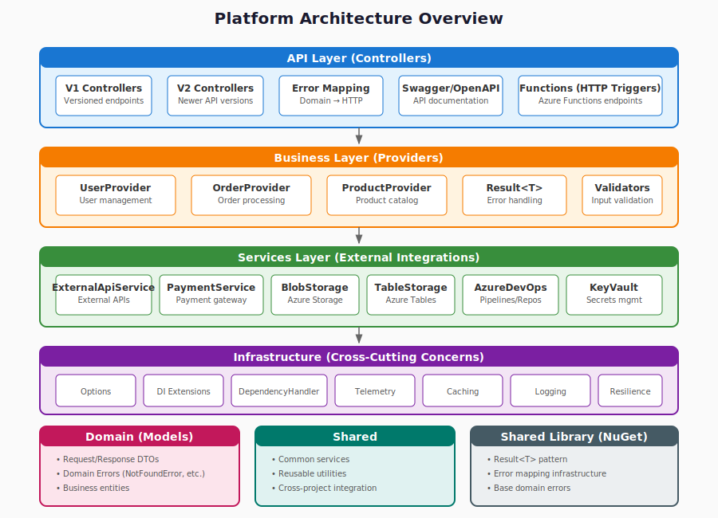

# System Architecture

## Overview

The platform follows a layered, microservices-inspired architecture with clear separation of concerns and well-defined integration points.



## Architecture Principles

1. **API-First** - All functionality exposed through versioned APIs
2. **Layered Design** - Clear separation: Presentation → Business → Data
3. **Dependency Inversion** - Depend on abstractions, not concretions
4. **Result Pattern** - Railway-oriented programming for error handling
5. **Configuration Driven** - Environment-specific settings via configuration

## Component Types

### API Layer (ASP.NET Core)

```
Controllers/
├── V1/                    # Version 1 endpoints
│   └── {Feature}Controller.cs
├── V2/                    # Version 2 endpoints
└── Common/                # Shared controllers (health, etc.)
```

**Responsibilities:**
- HTTP request/response handling
- Input validation
- Route mapping
- Error response formatting

### Business Layer (Providers)

```
Business/
├── {Feature}Provider.cs   # Orchestrates business logic
└── Interfaces/
    └── I{Feature}Provider.cs
```

**Responsibilities:**
- Business logic orchestration
- Multiple service coordination
- Caching decisions
- Result transformation

### Service Layer (External Integration)

```
Services/
├── {External}Service.cs   # Wraps external system
└── Interfaces/
    └── I{External}Service.cs
```

**Responsibilities:**
- Single external system wrapper
- HTTP client management
- Response mapping
- Retry/resilience policies

### Domain Layer

```
Domain/
├── Models/                # Business entities
├── Errors/                # Domain-specific errors
└── Contracts/             # Request/Response DTOs
```

## Integration Patterns

### HTTP Client Configuration

```csharp
// Using standard .NET HTTP client factory with typed clients
services.AddHttpClient<IExternalService, ExternalService>((sp, client) =>
{
    var options = sp.GetRequiredService<IOptions<ExternalServiceOptions>>().Value;
    client.BaseAddress = new Uri(options.BaseUrl);
}).AddHttpMessageHandler<DependencyHandler>();
```

### Error Flow

```
Controller → Provider → Service
    ↓           ↓          ↓
  Result     Result     Result
    ↓           ↓          ↓
ErrorMapper ← Error  ←  Error
    ↓
HTTP Response
```

## Deployment Architecture

### Environments

| Environment | Purpose | Configuration |
|-------------|---------|---------------|
| Development | Local development | appsettings.Development.json |
| Integration | CI/CD testing | appsettings.Int.json |
| Acceptance | UAT/Staging | appsettings.Acc.json |
| Production | Live system | appsettings.Pro.json |

### Azure Resources

- **App Service** - Web API hosting
- **Azure Functions** - Event-driven processing
- **API Management** - Gateway and policies
- **API Center** - API catalog and discovery
- **Key Vault** - Secrets management
- **Application Insights** - Monitoring and telemetry

## Security Architecture

### Authentication

- Azure AD / Entra ID for internal services
- API keys for external partners
- JWT tokens for user authentication

### Authorization

- Role-based access control (RBAC)
- Scope-based API permissions
- Resource-level authorization

### Data Protection

- TLS 1.3 for all communications
- Encryption at rest for sensitive data
- Secret rotation policies

## Related Documents

- [Stack Details](stack.md)
- [Glossary](glossary.md)
- [Architecture Decisions](decisions/)
